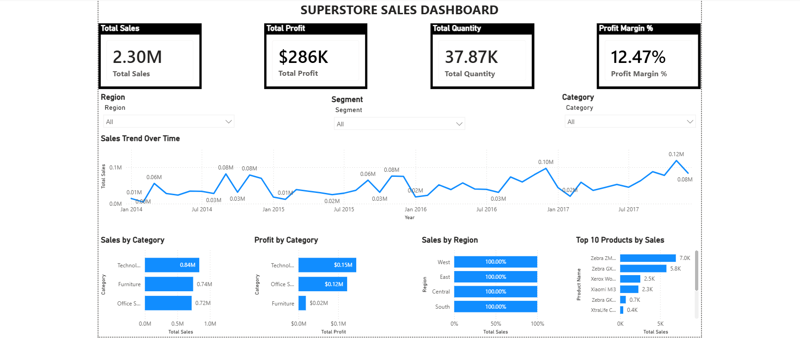

📊 Superstore Sales Dashboard | Power BI

 📌 Project Overview

This project is an interactive Power BI dashboard built using the Superstore Sales dataset. The dashboard provides a comprehensive view of sales performance, profitability, product performance, and regional trends, enabling data-driven business decisions.

The goal of this project is to transform raw sales data into meaningful insights through data visualization and business intelligence techniques.

---

 🎯 Business Problem

Businesses often struggle to identify:

- Which categories drive the highest revenue?
- Which products contribute the most sales?
- How profitability varies across categories?
- Which regions perform best?
- How sales trends change over time?

This dashboard helps answer these questions through interactive visualizations and KPI tracking.

---

 🛠️ Tools & Technologies

- Power BI Desktop
- Power Query
- DAX (Data Analysis Expressions)
- Data Modeling
- Interactive Filters & Slicers
- Data Visualization

---

 📈 Key Performance Indicators (KPIs)

| KPI | Value |
|------|------|
| Total Sales | 2.30M |
| Total Profit | 286K |
| Total Quantity Sold | 37.87K |
| Profit Margin | 12.47% |

---

 📊 Dashboard Features

 1️⃣ Sales Trend Over Time
- Line chart showing monthly sales performance.
- Helps identify growth patterns and seasonal trends.

 2️⃣ Sales by Category
- Compares revenue generated across product categories.
- Identifies highest-performing categories.

 3️⃣ Profit by Category
- Highlights category-wise profitability.
- Supports profit-focused business decisions.

 4️⃣ Sales by Region
- Regional sales comparison.
- Helps identify top-performing geographical markets.

 5️⃣ Top 10 Products by Sales
- Displays the highest revenue-generating products.
- Useful for inventory and product strategy.

---

 🎛 Interactive Filters

Users can dynamically filter the dashboard using:

- Region
- Segment
- Category

All visualizations update automatically based on selected filters.

---

 📌 Key Insights

- Technology is the highest revenue-generating category.
- Technology contributes the highest overall profit.
- Profit Margin stands at 12.47%.
- Sales demonstrate a positive trend over time.
- A small group of products contributes significantly to total revenue.
- Regional performance varies, highlighting opportunities for targeted growth.

---

 🧮 DAX Measures Used

Total Sales
```DAX
Total Sales = SUM(Orders[Sales])
```

Total Profit
```DAX
Total Profit = SUM(Orders[Profit])
```

Total Quantity
```DAX
Total Quantity = SUM(Orders[Quantity])
```

Profit Margin %
```DAX
Profit Margin % =
DIVIDE([Total Profit], [Total Sales], 0)
```

---

 📂 Dataset Information

The Superstore dataset contains:

- Order Details
- Customer Information
- Product Categories
- Sales Transactions
- Profit Metrics
- Regional Data

---

 💡 Skills Demonstrated

- Data Cleaning
- Data Transformation
- Data Modeling
- DAX Calculations
- KPI Development
- Interactive Dashboard Design
- Business Intelligence Reporting
- Data Visualization
- Analytical Thinking

---

 📷 Dashboard Preview



---

 🚀 Project Outcomes

This dashboard enables stakeholders to:

- Monitor sales performance
- Track profitability
- Analyze product performance
- Compare regional trends
- Make informed business decisions

---

 👨‍💻 Author

Narendra Patil

BCA Student | Aspiring Data Analyst

Skills:
- Power BI
- SQL
- Excel
- Python
- Data Visualization
- Business Analytics

 Connect With Me

- LinkedIn: https://www.linkedin.com/in/narendra-patil-637aa8343
- GitHub: https://github.com/narendra-p09

---
